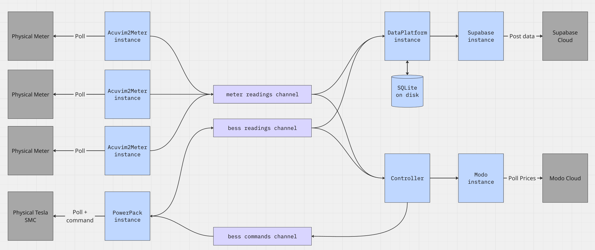

# bess-controller

A Go service to control batteries and associated metering. The service is currently compiled and run as a systemd service, to build it run: `go build main.go -o controller`.

The service accepts a JSON configuration file using the `-f` command line flag. An example configuration file is `./deployment/waterlilies_config.json`.

The high-level architecture of the program is shown in the following illustration: 

## Testing

To run unit tests:

`go test ./...`

## Cross-compilation

To compile a binary that will run on a 32bit ARM processor like the RPi:

`env GOARCH=arm GOARM=5 GOOS=linux go build -o ./deployment/bess_controller_rpi main.go`

## Deployment onto RPi

To deploy the service and config files onto a RPi over SSH:

`scp deployment/waterlilies_config.json pi@waterlillies-rpi:~/bess_controller/config.json`

`scp deployment/bess_controller.service pi@waterlillies-rpi:/lib/systemd/system`