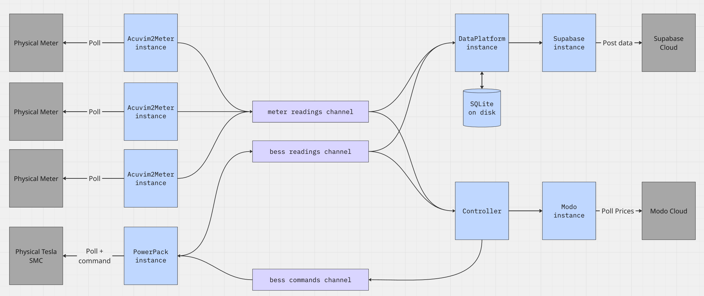

# bess-controller

A Go service to control a microgrid battery, read from on-site meters, and upload telemetry. 

Physical devices are queried over ModbusTCP, and the associated data (or 'readings') are distributed to the various modules that use the data (e.g. to upload as telemetry to the cloud, make decisions about control behaviour, etc)

The high-level architecture of the program is shown below:

## Configuration

Configuration of the physical devices, polling intervals, and controller strategy etc is via a YAML configuration file, use the `-f` command line flag to specify the file. An example configuration file is in `docs/debug.yaml`.

Secrets are supplied by environment variables. The names of the environemnt variables are specified in the configuration file.

The controller supports different control modes, some of which can operate entirely offline, whilst others require a connection to the internet and third-party platfroms. Most modes can be configured with a particular time of day, so that different modes can be activated at different times.

| Mode Name | Description |
|----------|----------|
| NIV Chase | This mode looks at System Settlement Price (imbalance price) predictions from Modo and either charges or discharges accordingly. Price curves are configured to define what constitues a good price for charging/discharging. Requires access to Modo platform for SSP estimates.
| Dynamic Peak Approach | Charges the battery ahead of a peak period (which is usually defined by a DUoS red band). It uses the Modo platform for NIV estimates to help determine when to charge.
| Dynamic Peak Discharge | Discharges the battery into a peak period (which is usually defined by DUoS red bands). If there is not enough energy to discharge at full power for the entire peak than times where the system is 'short' are preferred. Requires access to Modo platform for NIV estimates.
| Discharge to SoE    | If the battery is above a given SoE then the battery will be discharged down to the given SoE.
| Charge to SoE    | If the battery is below a given SoE then the battery will be charged up to the given SoE.
| Export Avoidance | Prevents the microgrid site from exporting energy to the national grid (i.e. sucks up any excess solar into the battery)
| Import Avoidance | Prevents the microgrid site from importing energy from the national grid
| Import Avoidance when short | Same as *Import Avoidance*, except it only activates when the Modo NIV estimate indicates that the system is short (and so grid prices are likely to be high)
| Axle    | Axle are a third-party flexibility trader and market-access provider who can dispatch the battery via schedules. This requires access to the Axle cloud platform.   |   

When mutliple modes are configured at the same time of day then the controller follows a prioritisation mechanism, see `src/controller/controller.go`.

## Installing Go
Follow instructions on the main Go website to install Go on your development system: https://go.dev/

## Testing

To run unit tests from the `src` directory:
- `go test ./...`

## Compilation

The following instructions assume you are in the `src` directory. And you may need to specify environment variables, depending on your configuration file.

To run the program on your computer:
- `go run main.go -f ../docs/debug.yaml`.

To compile a binary that will run on a 64bit ARM processor like the newer RevPi's:

`env GOARCH=arm64 GOOS=linux go build -o ../bess_controller_rpi_64 main.go`

To compile a binary that will run on the older 32bit ARM processors like the older RevPi's:

`env GOARCH=arm GOARM=5 GOOS=linux go build -o ../bess_controller_rpi main.go`
